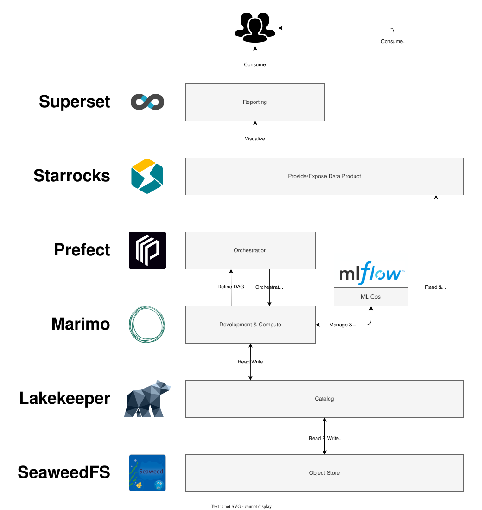

# Architecture

## Design

### Deplyoment method

All services in this architecture are capable to scale horizontally using Kubernetes, but for the sake of simplicity, we will deploy all services using docker compose on a single machine.

### Paradigm

We are aiming to build a data lakehouse built on open source software.  
The core services of a data lakehouse are:

1. Object Storage - Scalable, centralized data storage foundation
1. Catalog - Centralized metadata and access control
1. Orchestration - Automates and coordinates data workflows
1. Compute Engine - Processes and analyzes stored data
1. ML Ops - Operationalize ML & LLM development

To make it a complete Data Platform, wee need additional services:

1. Monitoring & Data Quality - Ensure high quality data products
1. Low Latency Data Base/Semantic Layer - Expose KPIs and multidimensional models
1. Data Visualization

### Diagram

## Core Platform services

### SeaweedFS

[Seaweed FS](services/seaweedFS.md) provides advanced blob storage capabilities with S3 API at cutting edge performance

### Lakekeeper

[Lakekeeper](services/lakekeeper.md) is a REST implementation of an Apache Icberg Catalog

### Prefect

[Prefect](services/prefect.md) is a python native orchestration engine, suited for our ETL orchestration needs

### Compute Engine

The actual compute will happen in regular python scripts, enhanced by [Marimo](services/marimo.md). This provides high flexibility in choosing an appropriate technology from SQL to dataframes with excellent integration in the Iceberg Catalog. Modern tools like polars and duckdb provide high performance up to a suprisingly high scale. If a scale is reached, in which horizontal scaleing becomes feasable, you are still capable to connect to a spark or ray cluster.

### MlFlow

With [MlFlow](services/mlflow.md) we gain end-to-end experiment tracking, observability, and evaluations, all in one integrated platform.

### UNDEFINED: MONITORING & QAULITY

TBD

### Starrocks

[Starrocks](services/superset.md) is a high performance data warehouse, optimized for low latency queries. This is perfectly suited for providing data to frontends/reports

### Apache Superset

[Apache Superset](services/superset.md) is a data visualization tool, we can use to create visual reports

## Utility Services

### Caddy

[Caddy](services/caddy.md) provides a reverse proxy, allowing us to access services via a unique adress, instead of accessing them with a specific port.

### Dockhand

[Dockhand](services/dockhand.md) provides easily accessilbe monitoring of all docker services, ensuring health, providing insight in resource usage and searching for vulnerabilities
